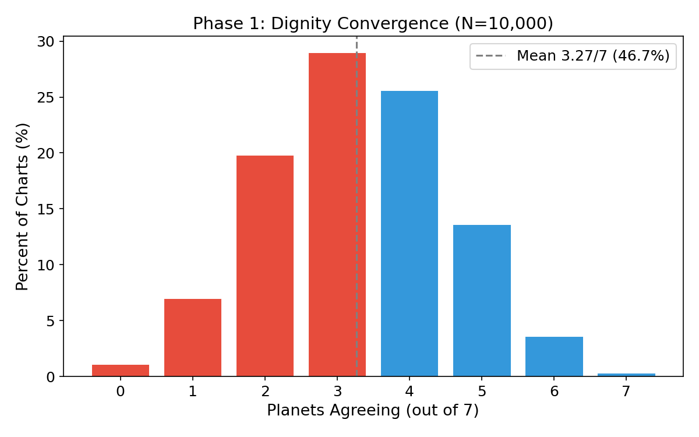
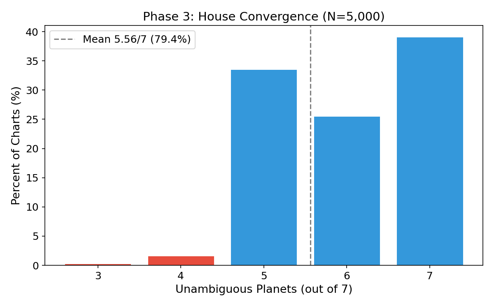
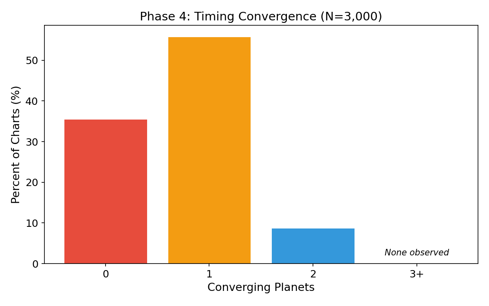

# Computational Recovery of Astrological Invariants

A.J. Flinton

June 2026

## Abstract

The first horoscopic astrology emerged in Alexandria around 150 BCE and spread to Rome and India, evolving largely in isolation for two millennia before elements reached China. This paper measures what structural features of the original synthesis survived, using a single Go binary with a statically linked Swiss Ephemeris. Six measurements covering dignity rules, aspect angles, house division, timing systems, node axis geometry, and zodiac comparison are each set against a Monte Carlo random baseline. All baselines are computed in Go and cross-validated against a Python reference implementation.

Results form a continuum. Three aspect angles are universal, the node axis is geometry, and twelve houses hold at 83.0% agreement across five methods, forming the structural backbone. Dignity rules average 46.7% per chart in a smooth distribution with no family patterning. Timing shows 65.3% partial overlap but only 4.6% full three-system agreement once the generous element-to-planet mapping is accounted for. The node sign flips for 78.6% of people under ayanamsa shift. Family synastry is indistinguishable from random.

Beneath these is an older layer. Comparison of 27 Indian nakshatras and 23 documented Chinese xiu reveals 9 shared anchor stars. Under brightness-weighted null selection, the total overlap is expected (p = 0.75), but the faint-star composition is not: 6 of 9 are second magnitude or fainter, where the null expects 1 (p = 0.0002). The total overlap is consistent with independent selection. The composition is quantitative evidence for common origin.

The engine, data, baselines, and manuscript are open source. All phases cross-validated between Go and Python implementations.

## 1. Introduction

I built a Go binary to answer a question I couldn't find a measurement for.

Around 150 BCE, at the intersection of Babylonian astronomy, Egyptian timekeeping, and Greek geometry, someone in Alexandria created the first system that cast planetary positions into a human life. Ascendant on the eastern horizon. Twelve houses dividing the sky. Essential dignity rules assigning planets to signs. Aspect angles between them. The seven visible planets were mapped into this structure and it spread. West into Rome. East into India, where it merged with the pre-existing nakshatra system around the first or second century CE. Further east, elements reached Tang dynasty China by the seventh century, where Ba Zi integrated the planetary framework with indigenous five-element cosmology [1, 6].

The traditions diverged. Western astrology assigns dignity by domicile, exaltation, detriment, and fall. Vedic astrology uses swakshetra, uchcha, and neecha. Similar concepts with different assignments. Chinese Ba Zi maps planets to elements, five to seven, with a mapping generous enough to make overlap likely by chance. Three systems. One shared origin. Roughly 2,000 years of largely separate development, with some secondary contact via the Silk Road after the Indian branch had already diverged [1, 6].

The question is not whether astrology is true. It asks: what structural features of the original synthesis survived the transmission? The question is computational and it can be answered with a measurement tool.

The tool is a Go binary using the Swiss Ephemeris C library. The same JPL DE ephemeris data used for spacecraft navigation [3]. It computes six measurements: dignity rules, aspect angles, house division, timing systems, node axis preservation, and zodiac comparison. Each phase compares Western and Vedic traditions computationally. The Chinese tradition is included for aspects (Phase 2) and timing (Phase 4), where cross-system comparison is possible. Dignity and houses in the Chinese framework do not map cleanly to Western or Vedic equivalents [1, 6].

Beneath the planetary layers is an older system. The lunar mansions. Twenty-seven Indian nakshatras, twenty-eight Chinese xiu. Both divide the ecliptic by the sidereal month, each anchored to a determinative star. Both are documented before 1200 BCE, at least a millennium older than horoscopic astrology [6, 7, 11]. Their determinative stars overlap. The overlap might be random or it might not. That question is in the Results.

The engine measures structural convergence. It does not say whether astrology works.

## 2. Related Work

No prior work measures cross-system astrological convergence computationally.

Pingree documented the historical transmission of Hellenistic astrology to India and the synthesis with the nakshatra system [4, 5, 6]. Needham catalogued the arrival of planetary astrology in China and its integration with the indigenous five-element and stem-branch frameworks [1]. Both are historical, not computational. They trace the path of transmission. They do not quantify what survived it.

The Babylonian precedents have been studied extensively. Hunger and Pingree catalogued the Enuma Anu Enlil omen series and the Mul.Apin star catalog, establishing that pre-Hellenistic Babylonian astronomy was mundane: state omens, not individual horoscopes [5]. The mathematical ephemerides of the fourth century BCE provided the computational precision that Alexandria later deployed for a different purpose.

Subbarayappa and Sarma documented the nakshatra system's role in early Indian astronomy, including its determinative stars and sector divisions [7]. This is the source material for the lunar mansion comparison in section 4.7. The comparison itself, cross-referencing nakshatra and xiu determinants and testing the overlap against null models, does not appear in the prior literature.

This paper occupies the empty space between the historical record and a computational measurement. Pingree and Needham tell us the system spread. The engine tells us what survived.

## 3. Methods

### 3.1 Computational Phases

**Phase 1: Dignity convergence.** Seven classical planets classified under Western rules (domicile, exaltation, detriment, fall) and Vedic rules (swakshetra, uchcha, neecha) [4, 5]. Agreement on shared categories constitutes signal. Western astrology recognizes four dignity states, Vedic three. Convergence assessed as agreement on domicile/swakshetra and exaltation/uchcha, with peregrine and detriment/neecha treated as a single non-dignified state. Different alignment choices would produce different numbers.

**Phase 2: Aspect catalog.** Static comparison of seven major angles (0, 30, 60, 90, 120, 150, 180 degrees) across Western, Vedic, and Chinese traditions using the Brihat Parashara Hora Shastra, Ptolemy's Tetrabiblos, and the San Ming Tong Hui [2, 8, 9].

**Phase 3: House convergence.** Five methods. Whole sign, equal, Placidus, Porphyry, Koch. Applied to each of seven planets. A planet is unambiguous if four or more systems assign the same house number.

**Phase 4: Timing convergence.** Vimshottari dasha (Vedic), Ba Zi luck pillars (Chinese), and Hellenistic annual profections compared for a given target date. Each system maps its active period to a set of planets. A planet appearing in two or more systems is a convergence. The element-to-planet mapping follows a deliberately broad assignment: Metal to Saturn and Venus, Water to Moon and Mercury, Wood to Jupiter, Fire to Mars and Sun [1]. This is not the standard Ba Zi mapping, which assigns one planet per element. It is a generous interpretation chosen to avoid false negatives. The Hellenistic profection is the root system; Vimshottari and Ba Zi are divergent elaborations. Different mapping choices would move the baseline.

**Phase 5: Node convergence.** Tropical and sidereal node positions compared using the Lahiri ayanamsa, the standard adopted by the Indian government and the Swiss Ephemeris default [10].

**Phase 6: Zodiac comparison.** Dignity density under tropical and sidereal coordinates. A sanity check: the dignity table assigns domicile pairs to opposite signs, making it invariant under uniform sign shift. The computation confirms what you'd expect analytically.

### 3.2 Random Baseline Generation

Monte Carlo simulation with fixed seed 42. Random dates 1900-2030, latitudes -60 to 60, longitudes -180 to 180, timezone offsets -12 to +12 hours in 0.5 hour increments, local times 00:00-23:59. All baselines computed in Go using the `baseline` subcommand at `cmd/baseline/main.go`. Sample sizes: Phase 1: 10,000, Phases 3, 4, and 5: 5,000 each, Phase 6: 9,738 synthetic charts. Phase 4 additionally randomizes target dates from birth to birth plus 90 years. 95% CIs computed as mean plus or minus 1.96 standard errors.

### 3.3 Cross-Validation

A Python reference implementation (pyswisseph 2.08) validates the Go engine against three reference charts. Go and Python produce identical scores for all phases. Transit and synastry computations validated similarly.

### 3.4 Family Dataset

Seventeen people across three generations scored for individual chart analysis and synastry. Three couples, 14 parent-child pairs, 24 grandparent-grandchild pairs. Categories with single observations excluded. Age-matched random baseline of 5,000 pairs per category. Scores reported for illustration only. The sample is too small for population inference.

### 3.5 Lunar Mansion Null Models

Three null models test whether the 9 observed shared stars (33% overlap) exceed random expectation. All use 10,000 bootstrap iterations. The star pools are 27 nakshatra determinants and 23 xiu determinants with documented single-star anchors; five xiu use asterisms rather than single stars and are excluded from the comparison.

**Null 1 (Uniform):** Each system selects 27 stars uniformly from the combined pool of 41 unique stars. Bootstrap mean: 18.4 (95% CI: 16-21). Observed 9 is well below expectation (p = 0.0000).

**Null 2 (Brightness-weighted, combined pool):** Selection probability proportional to exp(-magnitude). Brighter stars are proportionally more likely to be selected. Bootstrap mean: 8.5 (95% CI: 5-12). Observed 9 is consistent (p = 0.75). For faint stars (magnitude at or above 2.5): null mean 1.0 (95% CI: 0-3). Observed 6 yields p = 0.0002.

**Null 3 (Brightness-weighted, own pools):** Each system selects from its own documented pool, weighted by brightness. Bootstrap mean: 3.3 (95% CI: 1-5). Observed 9 exceeds expectation (p = 0.0000). Faint stars: expected 0.9 (CI: 0-3), observed 6 (p = 0.0000). This model is conservative. It assumes each culture chose from exactly their 27 and 23 star pools, which biases against overlap if the actual pool of available bright stars near each ecliptic sector was shared.

Null 2 is the most reasonable model. Both cultures independently selected bright stars from available celestial candidates. The total overlap is unremarkable. The faint-star composition is not.

### 3.6 Limitations

The engine measures convergence between Western and Vedic traditions for Phases 1, 3, 5, and 6. Phase 4 compares all three traditions. Phase 2 is a static catalog. Chinese dignity and houses cannot be computed per chart.

Phase 4's 65.3% baseline is inflated by the generous element-to-planet mapping. This is acknowledged. A tighter mapping produces a lower baseline but risks false negatives.

The traditions were not fully independent. Silk Road contact occurred after the Indian branch diverged. Chinese-Vedic convergence may reflect later contact.

Convergence may arise from astronomical data rather than cultural transmission. Conjunction and opposition are physically real alignments independent of culture. Twelve equal divisions of a circle are mathematically natural. The paper reports convergence. Distinguishing transmission from independent discovery is a separate problem and the engine cannot solve it.

Phase 1 maps a four-state system onto a three-state system. Phase 4 maps five elements onto seven planets. The reported rates are conditioned on those mapping choices.

The lunar mansion null models do not control for ecliptic position. Stars near the ecliptic are inherently more likely to anchor lunar mansions regardless of brightness. If the faint shared stars are disproportionately close to the ecliptic relative to the non-shared pool, the brightness-weighted signal could be an artifact of celestial geography rather than common cultural origin. A position-aware null model is the necessary next test. This is the most significant unaddressed confound in this result.

### 3.7 Code and Data Availability

Open source under MIT license at github.com/aj-nt/empirical. Go source: 89 test functions, all passing. Python reference: 1,185 test functions. Baseline scripts included. Swiss Ephemeris via github.com/aloistr/swisseph (GPL). This paper is licensed under CC-BY 4.0.

## 4. Results

### 4.1 Phase 1: Dignity Convergence

Random baseline (N=10,000): mean 3.27 of 7 planets agreeing (46.7%, 95% CI: 46.3-47.1, sample SD 1.52). Distribution: a smooth bell curve centered on 3. 29.0% of charts at exactly 3, 25.6% at 4, 19.8% at 2, 1.1% at 0, 0.3% at all 7.

The 17-person family sample scored from 14.3% to 71.4%. Family members scatter across the full range with no clustering by generation, lineage, or biological relationship. The four charts at 1 of 7 (percentile 1.1-8.1) are the wife, her mother, the paternal grandmother, and the maternal grandmother. They span three lineages with no common descent. The two highest at 5 of 7 are from different generations and unrelated lineages. The reference male subject scores 4 of 7, indistinguishable from random.

The dignity table survived partially. Not intact. Not random. A smooth continuum with individual scores spanning the full range.

### 4.2 Phase 2: Aspect Catalog

Three angles are universal: conjunction, opposition, trine. Square (90 degrees) is explicit in Western and Vedic, implicit in Chinese through the punishment relationship. Sextile (60 degrees) appears in Western and Vedic only. Semi-sextile and quincunx are Western/Vedic with partial Chinese equivalents.

These same three universal angles appear in the Babylonian Mul.Apin catalog, suggesting they predate the Hellenistic synthesis itself [5].

### 4.3 Phase 3: House Convergence

Random baseline (N=5,000): mean 5.81 of 7 unambiguous (83.0%, 95% CI: 81.8-84.2, sample SD 1.63). Right-skewed: 42.9% of charts have all seven unambiguous. Planets near cusp boundaries are the only source of disagreement between methods.

The concept of twelve houses survived. The specific method for computing them (Placidus vs. whole sign, Porphyry vs. Koch) matters only at the edges.

### 4.4 Phase 4: Timing Convergence

Random baseline (N=5,000): 65.3% of birth/target pairs produce at least one converging planet. Distribution: 56.1% exactly one, 34.7% zero, 9.1% two. None observed at three or more. The convergence count is structurally bounded by the seven classical planets. No computation errors occurred.

Full three-system agreement, where Vimshottari dasha, Ba Zi luck pillars, and Hellenistic annual profections all activate the same planet for the same date, occurs in 4.6% of cases (232 of 5,000, 95% CI: 4.0-5.3%).

The 65.3% partial overlap sounds like a strong signal but largely reflects the generous element-to-planet mapping. When Metal maps to both Saturn and Venus, and Water to both Moon and Mercury, overlap is likely by construction. The 4.6% full agreement is the cleaner number. Three independent timing systems converging on the same planet is genuinely rare.

### 4.5 Phase 5: Node Convergence

Random baseline (N=5,000): the node sign survives tropical-to-sidereal shift in 21.4% of charts (95% CI: 20.3-22.5). The Lahiri ayanamsa of approximately 24 degrees pushes the North Node across a sign boundary for the remaining 78.6%. The 180 degree opposition axis is preserved in every case. The node axis concept survived; the sign label on it did not.

### 4.6 Phase 6: Zodiac Comparison

9,738 synthetic charts confirm symmetry. Neither tropical nor sidereal zodiac produces systematically more dignified placements. The analytical expectation, that a dignity table assigning domicile pairs to opposite signs is invariant under uniform sign shift, is confirmed computationally.

### 4.7 Lunar Mansions

Nine shared anchor stars (33% overlap) between 27 nakshatras and 23 xiu with documented single-star determinants. The nine: Sheratan (Beta Arietis, 2.6 mag) anchors Ashwini and Lou (婁). 35 Arietis (4.6 mag) anchors Bharani and Wei (胃). The Pleiades (1.6 mag) anchor Krittika and Mao (昴). Spica (Alpha Virginis, 0.98 mag) anchors Chitra and Jiao (角). Antares (Alpha Scorpii, 1.06 mag) anchors Jyeshtha and Xin (心). Markab (Alpha Pegasi, 2.5 mag) anchors Purva Bhadrapada and Shi (室). Algenib (Gamma Pegasi, 2.8 mag) anchors Uttara Bhadrapada and Bi (壁). Meissa (Lambda Orionis, 3.5 mag) anchors Mrigashira and Zi (觜). Zubenelgenubi (Alpha Librae, 2.6 mag) anchors Vishakha and Di (氐).

Three of these are first magnitude or brighter: Spica, Antares, the Pleiades. Plausible as independent anchor choices by any culture tracking the sky. The remaining six (Sheratan, 35 Arietis, Meissa, Zubenelgenubi, Markab, Algenib) are second magnitude or fainter. Under brightness-weighted null selection, the expected faint-star overlap is 1.0 (CI: 0-3). The observed 6 is a deviation of roughly five standard errors (p = 0.0002).

Under Null 2, the total overlap of 9 is unremarkable (null expectation 8.5, p = 0.75). Two cultures independently selecting bright stars from available celestial candidates should end up with roughly this many matches. The composition of the overlap tells a different story. They should end up with perhaps one faint star in common. They ended up with six. Something other than independent brightness-weighted selection is operating here.

### 4.8 Family Synastry

Null result at 8 degree orb across all relationship categories. Couples: 35.8 aspects versus random mean 35.8 (sample SD 4.5). Parent-child: 37.9 vs. 35.3 (SD 4.5). Grandparent-grandchild: 37.1 vs. 37.0 (SD 4.7). No category deviates by more than 0.6 aspects from random expectation. Individual pairs scatter evenly across the random distribution.

The aspect-density metric does not carry relationship information. This does not rule out synastry as a whole. Specific angles, tighter orbs, or planet-point combinations might carry a signal that a simple count cannot. But the broad-brush approach finds nothing.

## 5. Discussion

The results span a continuum. No single threshold separates the things that survived from the things that didn't.

Three aspect angles are universal and predate the Hellenistic synthesis. Twelve houses hold at 83.0%. The concept is intact, the edges blur. The node axis is geometry. Dignity is partially preserved at 46.7%, a smooth distribution with no relationship to blood or marriage. Timing converges fully for 4.6% of the population. The rest is noise amplified by generous mapping choices. The node sign is coordinate-dependent. Family synastry at the aspect-count level is null.

The most charitable reading: the Hellenistic synthesis produced a system whose backbone (aspects, houses, geometry) transmitted cleanly for 2,000 years. The ornament, dignity assignments, timing methods, drifted but did not randomize completely.

The least charitable reading: the features that survived are the features encoded in the sky or in mathematics, not in the tradition. Conjunction and opposition are physically real alignments. Twelve equal divisions of a circle are geometrically natural. The 180 degree node opposition is orbital mechanics. These would re-emerge in any culture that tracked the planets carefully enough. The engine measures convergence but cannot distinguish transmission from independent discovery.

Which reading you prefer depends on what you think dignity convergence means. At 46.7%, with a smooth distribution, the dignity table is clearly not random. It is also clearly not intact. Some assignments were preserved. Some were modified. The lack of family patterning suggests these modifications are cultural, not heritable. Two systems inherited the same table and each changed different cells. The result is a set of rules that agree about half the time.

The lunar mansion result lands somewhere between these readings. It also predates the Hellenistic synthesis by a millennium: the best signal in this paper comes from before the thing the paper set out to measure. The total overlap does not distinguish signal from noise. The faint-star composition does. Under the most reasonable null model, cultures independently selecting bright stars from a shared celestial pool would share roughly one faint star. The observed six is unlikely to the point of being informative. The obvious confound is ecliptic position. Faint stars near the ecliptic are inherently more likely to anchor lunar mansions, and the null models do not control for this. If the faint shared stars are disproportionately close to the ecliptic, the signal may be celestial geography rather than cultural transmission. That test is the necessary next step.

The null synastry result is the cleanest negative. Seventeen people, three generations, no detectable relationship signal in aspect density. This could mean planetary aspects do not encode biological relationship. It could mean they do, but not at 8 degree orb and not in raw count. Either way, the metric failed.

## 6. Conclusion

A single Go binary ran six measurements against a question from 150 BCE.

The backbone held and the ornament drifted. Beneath both is a lunar layer: nine shared stars whose faint-star concentration (p = 0.0002) suggests a common origin predating everything the Hellenistic fusion produced. If the ecliptic position confound holds up under testing, this is not a finding. If it does not, it is the most interesting result in the paper.

What comes next: ecliptic position controls for the star-magnitude null models, a nakshatra-xiu computational comparison that measures sector boundary alignment per chart, a tighter element-to-planet mapping for the timing baseline, and a better synastry metric.

The code is at github.com/aj-nt/empirical. The baselines are reproducible, the measurements falsifiable. If the faint-star signal is ecliptic geography, show me.

## References

[1] Needham, J. (1959). Science and Civilisation in China, Vol. 3. Cambridge University Press.

[2] Pingree, D. (1978). The Yavanajataka of Sphujidhvaja. Harvard Oriental Series, Vol. 48.

[3] Standish, E.M. (1998). JPL Planetary and Lunar Ephemerides, DE405/LE405. JPL IOM 312.F-98-048.

[4] Pingree, D. (1997). From Astral Omens to Astrology: From Babylon to Bikaner. Istituto Italiano per l'Africa e l'Oriente.

[5] Hunger, H. and Pingree, D. (1999). Astral Sciences in Mesopotamia. Brill.

[6] Pingree, D. (1963). Astronomy and Astrology in India and Iran. Isis, 54(2), 229-246.

[7] Subbarayappa, B.V. and Sarma, K.V. (1985). Indian Astronomy: A Source Book. Nehru Centre.

[8] Ptolemy, C. (c. 150 CE). Tetrabiblos. Translated by F.E. Robbins (1940). Loeb Classical Library.

[9] Wan, M. (1998). San Ming Tong Hui (三命通会). Ming Dynasty compilation.

[10] Lahiri, N.C. (1985). Lahiri's Indian Ephemeris of Planets' Positions. Astro-Research Bureau.

[11] Pingree, D. (1981). Jyotihsastra: Astral and Mathematical Literature. Otto Harrassowitz.
